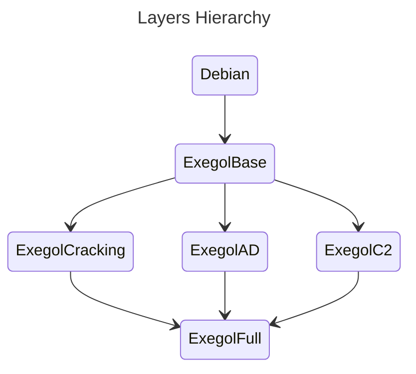

# Exegol images

> **📌 This repository hosts code for Exegol images, a submodule of the Exegol project.
> If you were looking for Exegol, go to [the main repo](https://github.com/ThePorgs/Exegol)**

This repository hosts Dockerfiles for each Exegol image, an installation script, and various assets needed during the install (custom configurations, a history file, an aliases file, etc.). These files can be used to locally build the docker images, there is however a pipeline in place to build and push images on DockerHub so that Exegol users don't have to build their own image.

More information on [the Exegol documenation](https://exegol.readthedocs.io/en/latest/the-exegol-project/docker-images.html).

## Architecture

All images are separated in different layers, known as intermediate images.
Images dependencies are as follows:



```Dockerfile

# ExegolBase

FROM Debian

RUN apt update && apt upgrade -y
RUN apt install $DEPENDENCIES

# Tag: exegolBase
```

```Dockerfile
FROM ExegolBase:latest

RUN apt update && apt upgrade -y
RUN apt install $DEPENDENCIES # installed => nothing, new => installed
# Tag: exegolBase
```

```Dockerfile
# ExegolIAD

FROM ExegolBase as build

RUN pipx install git+https://github.com/PorchettaIndustries/CrackMapExec.git 
# => /root/.local/bin/cme
# .....


FROM busybox:1.36-uclib

COPY --from=build /root/.local/bin/cme /root/.local/bin/cme

# tag: ExegolIAD
```

```Dockerfile
# ExegolFull
FROM EXEGOLIAD as iad
FROM EXEGOLIOSINT as iosint

FROM ExegolBase

COPY --from=iosint /root/.local/bin /root/.local/bin
COPY --from=iad /root/.local/bin /root/.local/bin
# ExegolIFull
```
