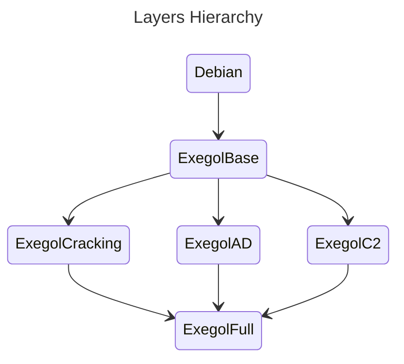

# Exegol images

> **📌 This repository hosts code for Exegol images, a submodule of the Exegol project.
> If you were looking for Exegol, go to [the main repo](https://github.com/ThePorgs/Exegol)**

This repository hosts Dockerfiles for each Exegol image, an installation script, and various assets needed during the install (custom configurations, a history file, an aliases file, etc.). These files can be used to locally build the docker images, there is however a pipeline in place to build and push images on DockerHub so that Exegol users don't have to build their own image.

More information on [the Exegol documenation](https://exegol.readthedocs.io/en/latest/the-exegol-project/docker-images.html).

## Architecture

All images are separated in different layers, known as intermediate images.
Images dependencies are as follows:

## Tool separation using multi images

Tools should be separated by package. They can be installed using 4 different ways:

- Static binaries: they can be copy pasted straight into the final image
- Dynamic binaries (using dynamic shared libraries):
  - We need to make sure all dependencies will be installed in the base image
    - No new dependency shall be installed in the intermediate image
  - We can copy the output binary straight into the final image
- Ruby programs
  - All of the gems installs can be confined to a single folder using the GEM_HOME variable.
  - We can then copy the GEM_FOLDER and merge it into the final image
- Python programs
  - All of the python programs should be installed using pipx or venv
    - We can then import the program folders straight into the final image
